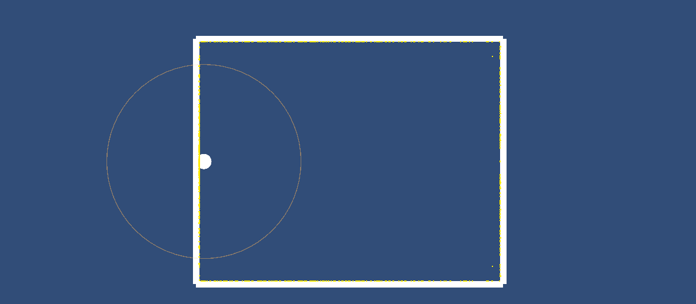
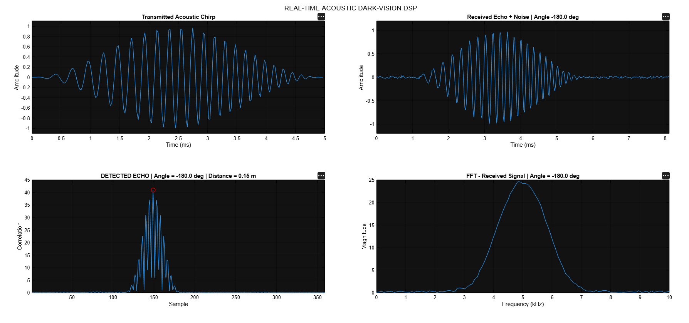
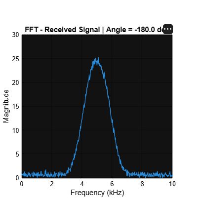

# 🌑 Real-Time 2D Acoustic Dark-Vision Mapping Using DSP

<p align="center">

### Seeing Without Seeing.

**A MATLAB + Unity DSP simulation for acoustic perception and 2D environment mapping.**

</p>

---

## 🎥 What is this?

Imagine a robot moving through a completely dark environment.

It cannot use a camera.

It cannot see the walls.

Instead, it sends out an **acoustic chirp**, listens for the returning echo, and uses **Digital Signal Processing** to estimate how far away the surrounding boundaries are.

This project simulates that entire process using:

**Unity → Acoustic Environment → MATLAB DSP → Echo Detection → Distance Estimation → 2D Acoustic Map**

---

## 🧠 The Core Idea

```text
                    ROBOT
                      │
                      ▼
               Acoustic Scan
                      │
                      ▼
               ┌──────────────┐
               │    UNITY     │
               │  2D WORLD    │
               └──────┬───────┘
                      │
                  UDP DATA
                      │
                      ▼
               ┌──────────────┐
               │    MATLAB    │
               │              │
               │ Chirp        │
               │ Echo         │
               │ Noise        │
               │ FFT          │
               │ Matched      │
               │ Filtering    │
               │ Peak Detect  │
               │ Time-of-Flight│
               └──────┬───────┘
                      │
               Estimated Distance
                      │
                      ▼
               ┌──────────────┐
               │    UNITY     │
               │              │
               │ Acoustic Map │
               └──────────────┘
````

---

# 🚀 Project Overview

The system is divided into two major components:

### 🎮 Unity

Unity acts as the **2D environment and robot simulator**.

It provides:

* Robot movement
* 2D room geometry
* Acoustic scanning directions
* Simulated obstacle distances
* Real-time acoustic pulse visualization
* Acoustic map reconstruction

### 📡 MATLAB

MATLAB performs the **Digital Signal Processing**.

It performs:

* Chirp generation
* Echo simulation
* Noise addition
* FFT analysis
* Matched filtering
* Peak detection
* Time-of-flight estimation
* Distance calculation

The two systems communicate through **UDP**.

---

# 🏗️ System Architecture

```text
                         UNITY
                           │
                           │
                    72-direction scan
                           │
                           ▼
                     Angle + Distance
                           │
                           │ UDP
                           ▼
                         MATLAB
                           │
                           ▼
                    Generate 3–7 kHz
                         Chirp
                           │
                           ▼
                     Simulate Echo
                           │
                           ▼
                       Add Noise
                           │
                     ┌─────┴─────┐
                     │           │
                     ▼           ▼
                    FFT     Matched Filter
                     │           │
                     │           ▼
                     │       Echo Peak
                     │           │
                     │           ▼
                     │     Time-of-Flight
                     │           │
                     │           ▼
                     │       Distance
                     │           │
                     └─────┬─────┘
                           │
                           │ UDP
                           ▼
                         UNITY
                           │
                           ▼
                     Acoustic Map
```

---

# 🖥️ Unity Environment

The simulation begins with a 2D environment containing a robot and surrounding boundaries.


The robot can move through the environment while continuously performing acoustic scans.

---

# 🔊 Acoustic Scanning

The robot scans its surroundings across **72 directions**.

Instead of relying on vision, each direction represents a simulated acoustic sensing path.



The expanding ring represents the propagation of the acoustic pulse.

The detected measurements are converted into spatial points that gradually form the acoustic representation of the environment.

---

# 🧮 The DSP Pipeline

The acoustic signal passes through multiple DSP stages.

```text
        Chirp Generation
               │
               ▼
        Echo Simulation
               │
               ▼
         Noise Addition
               │
               ▼
        Received Signal
               │
       ┌───────┴────────┐
       ▼                ▼
      FFT        Matched Filtering
       │                │
       ▼                ▼
 Frequency          Echo Peak
 Analysis           Detection
                         │
                         ▼
                  Time-of-Flight
                         │
                         ▼
                      Distance
```

---

# 📈 MATLAB DSP Output

MATLAB provides real-time visualization of the major DSP stages.



### The four plots represent:

| Plot                           | Purpose                                  |
| ------------------------------ | ---------------------------------------- |
| **Transmitted Acoustic Chirp** | Generated 3–7 kHz acoustic waveform      |
| **Received Echo + Noise**      | Delayed echo mixed with background noise |
| **Matched Filter Output**      | Detects the location of the echo         |
| **FFT - Received Signal**      | Shows the frequency-domain content       |

---

# ⚡ FFT Analysis

The received acoustic signal is transformed from the time domain into the frequency domain using the **Fast Fourier Transform**.

```text
Time Domain
     │
     │ FFT
     ▼
Frequency Domain
```

The transmitted signal is a **3–7 kHz chirp**, so the received signal contains strong frequency components across this region.

The FFT therefore provides a view of the frequency content of the received acoustic signal.

### Important distinction

FFT is used for **frequency-domain analysis**.

The actual echo distance is obtained using:

```text
Matched Filter
      ↓
Correlation Peak
      ↓
Time Delay
      ↓
Time-of-Flight
      ↓
Distance
```

---

# 🎯 Echo Detection

The system knows the waveform that was transmitted.

The received signal is compared with this known waveform using a **matched filter**.

A strong correlation peak indicates the location of the returning echo.

The distance is then calculated using:

$$
d = \frac{c\tau}{2}
$$

where:

* \(d\) = estimated distance
* \(c\) = speed of sound
* \(\tau\) = round-trip propagation time

The factor of 2 appears because the acoustic signal travels:

**Robot → Boundary → Robot**

---

# 🗺️ Acoustic Distance Mapping

For every scan angle, MATLAB obtains an estimated distance.

These measurements form a distance profile around the robot.



The graph represents:

**X-axis → Scan angle**

**Y-axis → Estimated acoustic distance**

This provides a polar-style representation of the surrounding environment.

---

# 🔄 MATLAB ↔ Unity Communication

The two systems communicate using UDP.

### Unity → MATLAB

```text
SCAN angle,distance
```

Example:

```text
SCAN -180,1.25;-175,1.30;-170,1.42;...
```

### MATLAB → Unity

```text
MEAS angle,estimatedDistance
```

Unity then converts these measurements into spatial map points.

---

# 🧠 DSP Concepts Used

| Concept                | Role                                      |
| ---------------------- | ----------------------------------------- |
| Sampling               | Digital representation of acoustic signal |
| LFM Chirp              | Broadband acoustic probing signal         |
| Hann Window            | Controls waveform edges                   |
| Echo Simulation        | Models propagation delay                  |
| Noise                  | Simulates non-ideal measurements          |
| FFT                    | Frequency-domain analysis                 |
| Matched Filter         | Echo detection                            |
| Correlation            | Signal similarity measurement             |
| Peak Detection         | Determines echo position                  |
| Time-of-Flight         | Measures propagation delay                |
| Distance Estimation    | Converts delay into distance              |
| Spatial Reconstruction | Builds 2D acoustic map                    |

---

# ⚙️ Technical Parameters

| Parameter             |    Value |
| --------------------- | -------: |
| Sampling Frequency    | 44.1 kHz |
| Chirp Start Frequency |    3 kHz |
| Chirp End Frequency   |    7 kHz |
| Chirp Duration        |     5 ms |
| Speed of Sound        |  343 m/s |
| Scan Directions       |       72 |
| Maximum Range         |     10 m |
| Communication         |      UDP |
| Simulation Engine     |    Unity |
| DSP Engine            |   MATLAB |

---

# 🧩 Technology Stack

```text
MATLAB
│
├── Signal Generation
├── FFT
├── Matched Filtering
├── Correlation
├── Peak Detection
└── Distance Estimation

Unity
│
├── 2D Physics
├── Robot Simulation
├── Acoustic Visualization
├── Spatial Mapping
└── Real-Time Interaction

UDP
│
└── MATLAB ↔ Unity Communication
```

---

# 📁 Project Structure

```text
Acoustic-Dark-Vision-DSP/
│
├── MATLAB/
│   └── dark_robot_dsp_server.m
│
├── Unity/
│   └── Assets/
│       ├── Scripts/
│       │   ├── AcousticRobotClient.cs
│       │   ├── AcousticPulse.cs
│       │   ├── AcousticMap.cs
│       │   └── RobotMovement.cs
│       │
│       └── Prefabs/
│           └── Pulse.prefab
│
├── Documentation/
│   ├── unity_environment.png
│   ├── unity_acoustic_scan.png
│   ├── matlab_dsp_output.png
│   └── distance_vs_angle.png
│
└── README.md
```

---

# ▶️ How To Run

### 1. Start MATLAB

Open:

```text
MATLAB/dark_robot_dsp_server.m
```

Run the script.

MATLAB starts the UDP server and waits for Unity.

### 2. Open Unity

Open the Unity project:

```text
Unity/
```

Open the Unity scene containing the acoustic dark-vision environment.

### 3. Press Play

Start the Unity simulation.

The robot begins scanning the environment.

### 4. Observe MATLAB

MATLAB receives the scan data and performs the DSP pipeline.

### 5. Observe Unity

The processed measurements are returned to Unity and visualized as an acoustic map.

---

# 📊 Results

The current simulation demonstrates the complete processing chain:

```text
Acoustic Signal
       ↓
Echo
       ↓
Noise
       ↓
FFT
       ↓
Matched Filtering
       ↓
Peak Detection
       ↓
Time-of-Flight
       ↓
Distance
       ↓
2D Acoustic Representation
```

The result is a simulated perception system where the environment can be represented using **acoustic measurements rather than visual information**.

---

# 🔮 Future Improvements

Possible extensions include:

* Real microphone input
* Real acoustic recordings
* Multiple acoustic receivers
* Real-time hardware implementation
* More realistic acoustic propagation
* Reverberation modelling
* Adaptive noise suppression
* Multi-target detection
* 3D acoustic mapping
* Real-world ultrasonic/acoustic sensing

---

